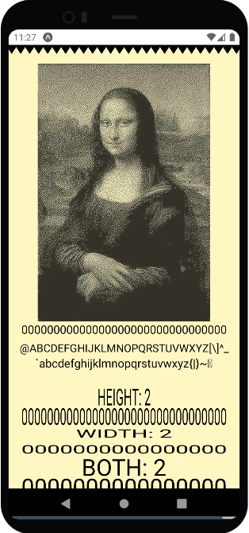

<br />

<p align="center">
  
</p>

<br />

<h2 align="center">An open-source cross-platform react-native library to use any kind of ESC/POS printer.</h1>

<br />

<p align="center">
  <a href="#"></a>
  <a href="#"></a>
  <a href="#"></a>
  <a href="#"></a>
</p>

<br />
<br />

Features:

- [x] API to create ESC/POS command buffers [Docs](https://react-native-pos-printer.github.io/docs)
- [x] Command chaining [Docs](https://react-native-pos-printer.github.io/docs)
- [x] Print to screen using `VirtualPaper` [Docs](https://react-native-pos-printer.github.io/docs)
- [x] Bluetooth connection [Docs](https://react-native-pos-printer.github.io/docs)

Todo:

- [ ] Read from Uint8Array buffer to `VirtualPaper`
- [ ] USB connection
- [ ] TCP connection GraphQL

<br/>

## VirtualPaper

<p align="center">
  
</p>

<br/>

## Getting Started

Basic usage

```ts
import POS, {
  createEscPosEncoder,
} from '@g01-tecnologia/react-native-pos-printer';

const PRINTER_MAC_ADDRESS = '00:00:00:00:00:00'; // Use your printer MAC Address here or get it via the Bluetooth module

// Call once, starts the bluetooth module
await POS.Bluetooth.start();
// Creates instance of the encoder class
const encoder = createEscPosEncoder();

// Uses chaining to queue commands and encodes it to
// single Uint8Array buffer
const commands: Uint8Array = encoder
  .initialize()
  .bold(true)
  .line('Hello, POS!')
  .bold(false)
  .encode();

// Uses bluetooth api to onnect to an
// already paired printer
await POS.Bluetooth.connect(PRINTER_MAC_ADDRESS);

// Sends ESC/POS commands to it
await POS.Bluetooth.sendCommands(commands);
```

## Documentation

For full documentation, visit [react-native-pos-printer.github.io/docs](https://react-native-pos-printer.github.io/docs)

To see how to Contribute, visit [Getting Started](./DEVELOPERS.md)

## Community & Support

- [Community Forum](https://github.com/gzero1/react-native-pos-printer/discussions). Best for: help with building, discussion about database best practices.
- [GitHub Issues](https://github.com/gzero1/react-native-pos-printer/issues). Best for: bugs and errors you encounter using Supabase.
- [Email Support](mailto:douugbr). Best for: problems with your database or infrastructure.
- [Discord](https://discord.gg/96NfVvqar4). Best for: sharing your applications and hanging out with the community.

## Status

- [x] Alpha: Not all basic functionalities are ready yet
- [ ] Public Alpha: Anyone can sign up. But go easy on us, there are a few kinks
- [ ] Public Beta: Stable enough for most non-enterprise use-cases
- [ ] Public: Production-ready

We are currently in Alpha. Watch "releases" of this repo to get notified of major updates.

<p align="center">
  <kbd></kbd>
</p>

## Special Thanks to

- [Niels Leenheer](https://github.com/NielsLeenheer/), creator of the original EscPosEncoder, CanvasDither and CanvasFlatten base!
- All future contributors, I'll try to mantain this project but I'll most certainly fail to do that, so feel free to contribute!

---
